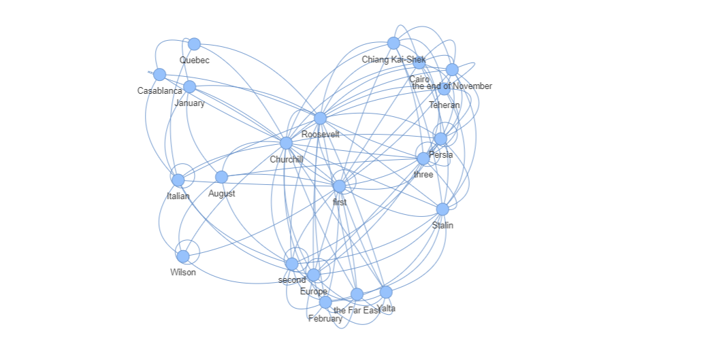

# Origin of the World Knowledge Graph

This project is designed to create a knowledge graph. They seem to be everywhere, so in order to speak confidently about them I would like to build one.



### How Knowledge Graphs Work

1. **Nodes**: Represent entities or concepts (e.g., people, places, organizations).
2. **Edges**: Represent relationships between nodes (e.g., "owns," "works at").
3. **Properties**: Nodes and edges can have attributes (e.g., age of a person, date of an event).

### Process:
- **Data Ingestion**: Data from various sources is structured as nodes and edges.
- **Traversal**: Queries traverse through nodes and relationships to find patterns or answer questions.
- **Schema-less**: The graph can evolve dynamically by adding new nodes or relationships without structural changes.

### Example: Knowledge Graph of the Romans

1. **Nodes**:
   - **Entities**: Julius Caesar, Roman Empire, Gaul, Augustus, Senate.
   
2. **Edges**:
   - **Relationships**:
     - *Julius Caesar → Conquered → Gaul*
     - *Julius Caesar → Assassinated by → Senate*
     - *Augustus → Succeeded → Julius Caesar*
     - *Roman Empire → Ruled by → Augustus*

3. **Properties**:
   - *Julius Caesar*: Birth year: 100 BC, Role: General, Dictator.
   - *Augustus*: Birth year: 63 BC, Role: First Roman Emperor.

### Process:
- **Data Ingestion**: Historical data on Roman figures, events, and places is structured into nodes (people, places) and edges (relationships like "conquered," "ruled by").
- **Traversal**: A query like "Who succeeded Julius Caesar?" would traverse the graph from Julius Caesar → Augustus.
- **Schema-less**: New entities (e.g., *Nero*) and relationships (e.g., *Nero → Ruled → Roman Empire*) can be added without restructuring the graph.

### Why Knowledge Graphs Over Normalized Databases?

1. **Complex Relationships**:
   - **Relational DB**: Handles simple, well-defined relationships. Complex joins slow down querying.
   - **KG**: Directly models complex relationships, allowing efficient traversal and queries.
   - **Example**: Fraud detection—quickly traverse relationships, unlike in relational DBs.

2. **Schema Flexibility**:
   - **Relational DB**: Requires predefined schema. Changing it later is costly.
   - **KG**: Schema-less, easily accommodates new entities and relationships.
   - **Example**: Healthcare—add new gene-disease relationships dynamically.

3. **Efficient Querying for Connections**:
   - **Relational DB**: Recursive or complex joins across tables are inefficient.
   - **KG**: Optimized for exploring relationships of any depth.
   - **Example**: Recommendations—easily traverse user-product connections.

4. **Data Integration**:
   - **Relational DB**: Poor at integrating heterogeneous data (structured/unstructured).
   - **KG**: Easily integrates data from diverse sources.
   - **Example**: Scientific research—integrates datasets, papers, profiles.

5. **Semantic Understanding**:
   - **Relational DB**: Stores raw data but lacks built-in semantics/context.
   - **KG**: Encodes meaning and relationships, aiding semantic search/NLP.
   - **Example**: NLP—distinguishes "Apple" the company from the fruit.

6. **Scalability with Connected Data**:
   - **Relational DB**: Performance degrades with complex, highly connected data.
   - **KG**: Optimized for scalable querying of large, connected datasets.
   - **Example**: Google’s Knowledge Graph—handles billions of relationships efficiently.

Relational databases excel in structured environments, but KGs are better suited for dynamic, highly interconnected, and complex data environments, such as recommendation systems, semantic search, and fraud detection.

### Examples of Knowledge Graph Use Cases: 

- Search Engine
- Document Query
- Social Media

### Data

In order to create my KG, I used the "Origin of the World", a novel by H.G Wells:

https://www.gutenberg.org/files/33049/33049-h/33049-h.htm

This was used because it contains a lot of interconnectivity of names, places, dates etc. that it would be perfect for a KG. The language model I used to understand the corpus and relate items was the large English model (en_core_web_lg) from spacy:

https://github.com/explosion/spacy-models

This model was picked as it is small enough to be saved and deployed but large enough to understand the text.

## Code

In this code I am using spacy, so the first step is to load the model: 

```python
nlp = spacy.load("en_core_web_lg")
```

There are then a number of functions that load clean the text, but the main code that is important with relationship buiding is here: 

```python
def add_to_graph(graph, doc):
    """
    Add entities to the graph and create edges based on the root verb and prepositional phrases in each sentence.
    """
    # Entity types to include in the graph
    valid_entity_types = {"PERSON", "ORG", "GPE", "LOC"}  # People, Organizations, Locations

    for sent in doc.sents:
        # Extract valid entities from the sentence
        entities_in_sentence = [ent for ent in sent.ents if ent.label_ in valid_entity_types]

        # Find the root verb and possible prepositional phrase
        root_verb = None
        prep_phrase = None
        modifiers = []  # To capture adverbs or adjectives that modify the verb

        for token in sent:
            if token.dep_ == "ROOT":
                root_verb = token.lemma_
            if token.dep_ == "prep":
                prep_phrase = token.text
            if token.dep_ in {"advmod", "amod"}:
                modifiers.append(token.text)

        # Combine root verb, prepositional phrase, and modifiers to form a more meaningful relationship
        if root_verb:
            # Build a detailed relationship string
            relationship = f"{root_verb} {' '.join(modifiers)} {prep_phrase}".strip()

            # Create edges only if there are more than one entity
            if len(entities_in_sentence) > 1:
                for i, ent1 in enumerate(entities_in_sentence):
                    for ent2 in entities_in_sentence[i+1:]:
                        if ent1 != ent2:
                            # Lowercase entities for consistent graph entries
                            entity1 = ent1.text.lower()
                            entity2 = ent2.text.lower()

                            # Avoid adding duplicate edges
                            if not graph.has_edge(entity1, entity2):
                                graph.add_edge(entity1, entity2, relationship=relationship)


```
This code manages the text and define what should be a node, how they should be linked and how the entity should be managed. 

We then use the nlp.pipe to run parrallel processing on the data:

```python
docs = nlp.pipe([text], batch_size=1, n_process=16) 
```

The output of this is a gml file which contains the relevant information on nodes and entities:

```gml
  node [
    id 2
    label "Sarajevo"
  ]
  node [
    id 3
    label "Belgian"
  ]
  node [
    id 4
    label "Japan"
  ]

   edge [
    source 0
    target 1
    relationship "write"
  ]
  edge [
    source 1
    target 10
    relationship "be"
  ]
  edge [
    source 1
    target 11
    relationship "be"
  ]
```

The __node__ is the entitiy itself, this could be a place, organisation or person.
The __edge__ is how the entities are related. For Example if might be "London" be "Europe".

All of these nodes and edges are connects to make the knowledge graph.

### Visualisations

Once the code has run, we can then visualise the data using __Networkx__:

```python
from pyvis.network import Network

# Create a PyVis network visualization for specific queries
net = Network(notebook=True)

# Create a subgraph containing only the neighbours of "Napoleon Bonaparte"
subgraph = graph.subgraph([query] + list(graph.neighbors(query)))
net.from_nx(subgraph)

# Display the graph
net.show("query_result.html")
```

### Learnings

There have been some key takeaways with this project:

- __Picked Relevant Subject Matter__: Initially I used training data that was not suited to KGs. The data needs to be relational, diverse and unstructured.
- __Spacy__: Seems to be a robust model suited to this work.
- __Parallelisation__: This is key to ensuring that operations don't run for too long. My computer has 64GB worth of RAM so was able to run multiple CPUS.
- __Visuals__: These graphs seem to be built of GML files, trying to graphically represent whole datasets is impossible, best to query the data to visualise the results of queries.
- __Ray__: Seems to be the most robust with respect to new versions of python with processing large files.

